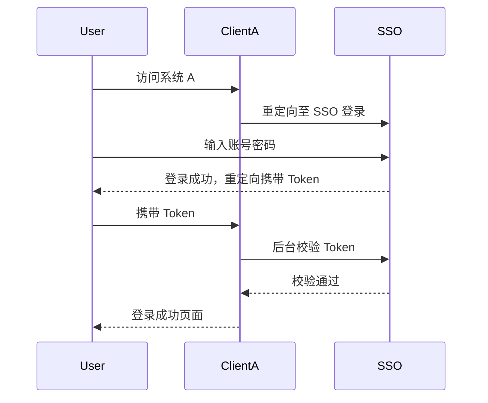

单点登录（**SSO，Single Sign-On**）是一种认证机制，允许用户在一个系统中登录一次后，自动访问所有相互信任的系统，而不需要在每个系统中都登录一次。

---

## 🔧 实现单点登录的核心思路

### 🌐 场景基础

* 多个系统（A、B、C）之间共享用户认证状态。
* 有一个**统一的认证中心**（SSO Server）。
* 各个系统为**受保护的子系统/应用**（SSO Client）。

---

## 📌 单点登录实现流程（基于 Cookie + Token）

### 👤 登录流程（首次访问某个子系统）：

1. 用户访问子系统 A。
2. 子系统 A 发现用户未登录，**跳转到 SSO 认证中心**（带上 redirect\_uri 参数，即登录成功后的跳转地址）。
3. 用户在 SSO 认证中心输入用户名/密码，验证成功后：

   * 在认证中心生成一个**全局令牌（Token or Ticket）**。
   * 将 token 写入 **SSO 域下的 Cookie**（如：`.example.com`）。
   * 将 token **通过 redirect\_uri 重定向到子系统 A**。
4. 子系统 A 拿到 token：

   * 向 SSO 认证中心后台校验 token 是否有效。
   * 校验成功后，在本地创建登录状态（如本地 session）。
5. 用户现在已登录子系统 A，同时也登录了整个 SSO 网络。

---

### ✅ 再次访问子系统 B：

1. 用户访问子系统 B，未登录。
2. 跳转到 SSO 认证中心。
3. 由于 Cookie 中已有有效 token，SSO 无需用户再次输入账号密码。
4. SSO 重定向回子系统 B，携带 token。
5. 子系统 B 校验 token → 登录成功。

---

## 🔄 登出流程（全局退出）：

1. 用户点击“退出”按钮。
2. 向 SSO 认证中心发起登出请求。
3. SSO 删除全局 token，同时通知所有子系统清除本地登录状态（可以用后台 HTTP 通知、WebSocket 等）。
4. 清除所有登录状态。

---

## 🧰 技术方案选型

| 技术方案                                    | 优势             | 适用场景        |
| --------------------------------------- | -------------- | ----------- |
| **JWT（JSON Web Token）**                 | 无状态、跨域支持、移动端友好 | 前后端分离、微服务   |
| **OAuth 2.0 / OpenID Connect**          | 标准协议、第三方授权支持   | 第三方登录、平台级系统 |

---

## 🌍 跨域 Cookie 注意事项

由于 SSO 涉及多个子系统，**跨域访问的 Cookie 是个大坑**，注意以下点：

* 设置 Cookie 的 `Domain=example.com`，适配所有子域。
* 设置 `SameSite=None` 且 `Secure`，以便在 HTTPS 下跨域发送 Cookie。
* 建议统一为 HTTPS，避免安全问题。

---

## 📦 实战示例（简化）

---

## 🛡️ 安全建议

* Token 有效期控制（支持刷新机制）。
* Token 签名与加密（防止篡改）。
* 防止 CSRF（跨站请求伪造）。
* HTTPS 强制使用。
* 全局登出同步机制。

---

