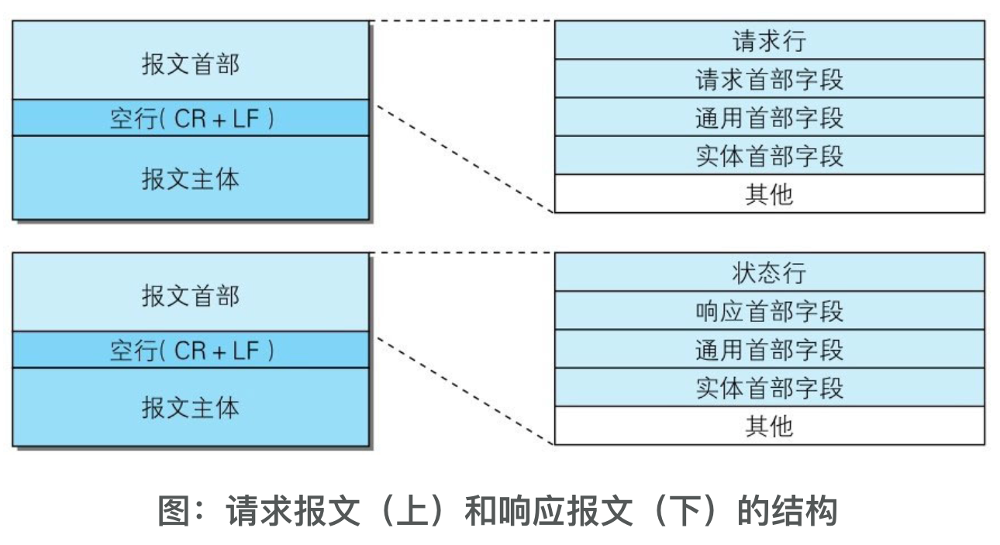

应用层
应用层决定了向用户提供应用服务时通信的活动。
TCP/IP协议族内预存了各类通用的应用服务。比如，FTP（File Transfer Protocol，文件传输协议）和DNS（Domain Name System，域名系统）服务就是其中两类。HTTP协议也处于该层。

传输层
传输层对上层应用层，提供处于网络连接中的两台计算机之间的数据传输。
在传输层有两个性质不同的协议：TCP（Transmission Control Protocol，传输控制协议）和UDP（User Data Protocol，用户数据报协议）。

网络层（又名网络互连层）
网络层用来处理在网络上流动的数据包。数据包是网络传输的最小数据单位。该层规定了通过怎样的路径（所谓的传输路线）到达对方计算机，并把数据包传送给对方。与对方计算机之间通过多台计算机或网络设备进行传输时，网络层所起的作用就是在众多的选项内选择一条传输路线。

链路层（又名数据链路层，网络接口层）
用来处理连接网络的硬件部分。包括控制操作系统、硬件的设备驱动、NIC（Network Interface Card，网络适配器，即网卡），及光纤等物理可见部分（还包括连接器等一切传输媒介）。硬件上的范畴均在链路层的作用范围之内。


我们用HTTP举例来说明，首先作为发送端的客户端在应用层（HTTP协议）发出一个想看某个Web页面的HTTP请求。
接着，为了传输方便，在传输层（TCP协议）把从应用层处收到的数据（HTTP请求报文）进行分割，并在各个报文上打上标记序号及端口号后转发给网络层。
在网络层（IP协议），增加作为通信目的地的MAC地址后转发给链路层。
这样一来，发往网络的通信请求就准备齐全了。
接收端的服务器在链路层接收到数据，按序往上层发送，一直到应用层。
当传输到应用层，才能算真正接收到由客户端发送过来的HTTP请求。

IP协议的作用是把各种数据包传送给对方。而要保证确实传送到对方那里，则需要满足各类条件。其中两个重要的条件是IP地址和MAC地址（Media Access Control Address）。IP地址指明了节点被分配到的地址，MAC地址是指网卡所属的固定地址。IP地址可以和MAC地址进行配对。IP地址可变换，但MAC地址基本上不会更改。

IP间的通信依赖MAC地址。在网络上，通信的双方在同一局域网（LAN）内的情况是很少的，通常是经过多台计算机和网络设备中转才能连接到对方。而在进行中转时，会利用下一站中转设备的MAC地址来搜索下一个中转目标。这时，会采用ARP协议（Address Resolution Protocol）。ARP是一种用以解析地址的协议，根据通信方的IP地址就可以反查出对应的MAC地址。

按层次分，TCP位于传输层，提供可靠的字节流服务。所谓的字节流服务（Byte Stream Service）是指，为了方便传输，将大块数据分割成以报文段（segment）为单位的数据包进行管理。而可靠的传输服务是指，能够把数据准确可靠地传给对方。一言以蔽之，TCP协议为了更容易传送大数据才把数据分割，而且TCP协议能够确认数据最终是否送达到对方。

TCP协议采用了三次握手
握手过程中使用了TCP的标志（flag）——SYN（synchronize）和ACK（acknowledgement）。发送端首先发送一个带SYN标志的数据包给对方。接收端收到后，回传一个带有SYN/ACK标志的数据包以示传达确认信息。最后，发送端再回传一个带ACK标志的数据包，代表“握手”结束。

DNS（Domain Name System）服务是和HTTP协议一样位于应用层的协议。它提供域名到IP地址之间的解析服务。


1.7
URI用字符串标识某一互联网资源，而URL表示资源的地点（互联网上所处的位置）。可见URL是URI的子集。

2.2
请求报文是由请求方法、请求URI、协议版本、可选的请求首部字段和内容实体构成的。


响应报文基本上由协议版本、状态码（表示请求成功或失败的数字代码）、用以解释状态码的原因短语、可选的响应首部字段以及实体主体构成。

2.5
CONNECT：要求用隧道协议连接代理
CONNECT方法要求在与代理服务器通信时建立隧道，实现用隧道协议进行TCP通信。主要使用SSL（Secure Sockets Layer，安全套接层）和TLS（Transport Layer Security，传输层安全）协议把通信内容加密后经网络隧道传输。

2.6
GET POST PUT DELETE HEAD CONNECT TRACE OPTIONS


2.7.1
HTTP/1.1和一部分的HTTP/1.0想出了持久连接（HTTP Persistent Connections，也称为HTTP keep-alive或HTTP connection reuse）的方法。持久连接的特点是，只要任意一端没有明确提出断开连接，则保持TCP连接状态。

持久连接的好处在于减少了TCP连接的重复建立和断开所造成的额外开销，减轻了服务器端的负载。另外，减少开销的那部分时间，使HTTP请求和响应能够更早地结束，这样Web页面的显示速度也就相应提高了

2.8
Cookie会根据从服务器端发送的响应报文内的一个叫做Set-Cookie的首部字段信息，通知客户端保存Cookie。当下次客户端再往该服务器发送请求时，客户端会自动在请求报文中加入Cookie值后发送出去。

3.2

请求行
包含用于请求的方法，请求URI和HTTP版本。
状态行
包含表明响应结果的状态码，原因短语和HTTP版本。
首部字段
包含表示请求和响应的各种条件和属性的各类首部。一般有4种首部，分别是：通用首部、请求首部、响应首部和实体首部。
其他
可能包含HTTP的RFC里未定义的首部（Cookie等）。



3.3
●报文（message）
是HTTP通信中的基本单位，由8位组字节流（octet sequence，其中octet为8个比特）组成，通过HTTP通信传输。
●实体（entity）
作为请求或响应的有效载荷数据（补充项）被传输，其内容由实体首部和实体主体组成。
HTTP报文的主体用于传输请求或响应的实体主体。通常，报文主体等于实体主体。只有当传输中进行编码操作时，实体主体的内容发生变化，才导致它和报文主体产生差异。

内容编码指明应用在实体内容上的编码格式，并保持实体信息原样压缩。内容编码后的实体由客户端接收并负责解码。
内容编码有以下几种。●gzip（GNU zip）●compress（UNIX系统的标准压缩）●deflate（zlib）●identity（不进行编码）

3.3.3 分割发送的分块传输编码在HTTP通信过程中，请求的编码实体资源尚未全部传输完成之前，浏览器无法显示请求页面。在传输大容量数据时，通过把数据分割成多块，能够让浏览器逐步显示页面。这种把实体主体分块的功能称为分块传输编码（Chunked Transfer Coding）。

分块传输编码会将实体主体分成多个部分（块）。每一块都会用十六进制来标记块的大小，而实体主体的最后一块会使用“0(CR+LF)”来标记。

3.4
HTTP协议中也采纳了多部分对象集合，发送的一份报文主体内可含有多类型实体。通常是在图片或文本文件等上传时使用。
● multipart/form-data在Web表单文件上传时使用。● multipart/byteranges状态码206（Partial Content，部分内容）响应报文包含了多个范围的内容时使用。

使用boundary字符串来划分多部分对象集合指明的各类实体。在boundary字符串指定的各个实体的起始行之前插入“--”标记（例如：--AaB03x、--THIS_STRING_SEPARATES），而在多部分对象集合对应的字符串的最后插入“--”标记（例如：--AaB03x--、--THIS_STRING_SEPARATES--）作为结束。

针对范围请求，响应会返回状态码为206 Partial Content的响应报文。另外，对于多重范围的范围请求，响应会在首部字段Content-Type标明multipart/byteranges后返回响应报文。如果服务器端无法响应范围请求，则会返回状态码200 OK和完整的实体内容。

3.6
内容协商机制是指客户端和服务器端就响应的资源内容进行交涉，然后提供给客户端最为适合的资源。内容协商会以响应资源的语言、字符集、编码方式等作为判断的基准。
●Accept
●Accept-Charset
●Accept-Encoding
●Accept-Language
●Content-Language

4.2
状态码
200 请求被正常处理
204 no content
206 Partial Content

301 永久性重定向。该状态码表示请求的资源已被分配了新的URI，以后应使用资源现在所指的URI。
302 临时性重定向。该状态码表示请求的资源已被分配了新的URI，希望用户（本次）能使用新的URI访问。
303 该状态码表示由于请求对应的资源存在着另一个URI，应使用GET方法定向获取请求的资源。当301、302、303响应状态码返回时，几乎所有的浏览器都会把POST改成GET，并删除请求报文内的主体，之后请求会自动再次发送。301、302标准是禁止将POST方法改变成GET方法的，但实际使用时大家都会这么做。
304 Not Modified （服务器端资源未改变，可直接使用客户端未过期的缓存）。304状态码返回时，不包含任何响应的主体部分。304虽然被划分在3XX类别中，但是和重定向没有关系。
307 Temporary Redirect临时重定向。307会遵照浏览器标准，不会从POST变成GET。

400 Bad Request 该状态码表示请求报文中存在语法错误。当错误发生时，需修改请求的内容后再次发送请求。另外，浏览器会像200 OK一样对待该状态码。
401 Unauthorized 该状态码表示发送的请求需要有通过HTTP认证（BASIC认证、DIGEST认证）的认证信息。另外若之前已进行过1次请求，则表示用户认证失败。返回含有401的响应必须包含一个适用于被请求资源的WWW-Authenticate首部用以质询（challenge）用户信息。当浏览器初次接收到401响应，会弹出认证用的对话窗口。
403 Forbidden 该状态码表明对请求资源的访问被服务器拒绝了。服务器端没有必要给出拒绝的详细理由，但如果想作说明的话，可以在实体的主体部分对原因进行描述，这样就能让用户看到了。
404 Not Found 该状态码表明服务器上无法找到请求的资源。除此之外，也可以在服务器端拒绝请求且不想说明理由时使用。
500 Internal Server Error
503 Service Unavailable 该状态码表明服务器暂时处于超负载或正在进行停机维护，现在无法处理请求。


5.1
一台HTTP服务器搭建多个Web站点，这是因为利用了虚拟主机（Virtual Host，又称虚拟服务器）的功能。
在相同的IP地址下，由于虚拟主机可以寄存多个不同主机名和域名的Web网站，因此在发送HTTP请求时，必须在Host首部内完整指定主机名或域名的URI。

5.2 通信数据转发程序：代理、网关、隧道
这些应用程序和服务器可以将请求转发给通信线路上的下一站服务器，并且能接收从那台服务器发送的响应再转发给客户端。

代理
代理是一种有转发功能的应用程序，它扮演了位于服务器和客户端“中间人”的角色，接收由客户端发送的请求并转发给服务器，同时也接收服务器返回的响应并转发给客户端。
代理服务器的基本行为就是接收客户端发送的请求后转发给其他服务器。代理不改变请求URI，会直接发送给前方持有资源的目标服务器。
在HTTP通信过程中，可级联多台代理服务器。请求和响应的转发会经过数台类似锁链一样连接起来的代理服务器。转发时，需要附加Via首部字段以标记出经过的主机信息。
使用代理服务器的理由有：利用缓存技术（稍后讲解）减少网络带宽的流量，组织内部针对特定网站的访问控制，以获取访问日志为主要目的，等等。代理有多种使用方法，按两种基准分类。一种是是否使用缓存，另一种是是否会修改报文。
缓存代理
透明代理

网关
网关是转发其他服务器通信数据的服务器，接收从客户端发送来的请求时，它就像自己拥有资源的源服务器一样对请求进行处理。有时客户端可能都不会察觉，自己的通信目标是一个网关。

网关的工作机制和代理十分相似。而网关能使通信线路上的服务器提供非HTTP协议服务。利用网关能提高通信的安全性，因为可以在客户端与网关之间的通信线路上加密以确保连接的安全。比如，网关可以连接数据库，使用SQL语句查询数据。另外，在Web购物网站上进行信用卡结算时，网关可以和信用卡结算系统联动。

隧道
隧道是在相隔甚远的客户端和服务器两者之间进行中转，并保持双方通信连接的应用程序。
隧道可按要求建立起一条与其他服务器的通信线路，届时使用SSL等加密手段进行通信。隧道的目的是确保客户端能与服务器进行安全的通信。隧道本身不会去解析HTTP请求。也就是说，请求保持原样中转给之后的服务器。隧道会在通信双方断开连接时结束。

5.3
缓存服务器是代理服务器的一种，并归类在缓存代理类型中。换句话说，当代理转发从服务器返回的响应时，代理服务器将会保存一份资源的副本。
缓存服务器的优势在于利用缓存可避免多次从源服务器转发资源。因此客户端可就近从缓存服务器上获取资源，而源服务器也不必多次处理相同的请求了。

6.1 

HTTP请求报文在请求中，HTTP报文由方法、URI、HTTP版本、HTTP首部字段等部分构成。

```yaml
    GET / HTTP/1.1
    Host: hackr.jp
    User-Agent: Mozilla/5.0 (Windows NT 6.1; WOW64; rv:13.0) Gecko/=>
    20100101 Firefox/13.0
    Accept: text/html, application/xhtml+xml, application/xml; q=0.9, =>
    ＊/＊; q=0.8
    Accept-Language: ja,en-us;q=0.7,en;q=0.3
    Accept-Encoding: gzip, deflate
    DNT: 1
    Connection: keep-alive
    If-Modified-Since: Fri, 31 Aug 2007 02:02:20 GMT
    If-None-Match: "45bae1-16a-46d776ac"
    Cache-Control: max-age=0
```


HTTP响应报文在响应中，HTTP报文由HTTP版本、状态码（数字和原因短语）、HTTP首部字段3部分构成。
```yaml
    HTTP/1.1304 Not Modified
    Date: Thu, 07 Jun 2012 07:21:36 GMT
    Server: Apache
    Connection: close
    Etag: "45bae1-16a-46d776ac"
```


4种HTTP首部字段类型
HTTP首部字段根据实际用途被分为以下4种类型。
通用首部字段（General Header Fields）
请求报文和响应报文两方都会使用的首部。
请求首部字段（Request Header Fields）从客户端向服务器端发送请求报文时使用的首部。补充了请求的附加内容、客户端信息、响应内容相关优先级等信息。
响应首部字段（Response Header Fields）从服务器端向客户端返回响应报文时使用的首部。补充了响应的附加内容，也会要求客户端附加额外的内容信息。
实体首部字段（Entity Header Fields）针对请求报文和响应报文的实体部分使用的首部。补充了资源内容更新时间等与实体有关的信息。


非HTTP/1.1首部字段在HTTP协议通信交互中使用到的首部字段，不限于RFC2616中定义的47种首部字段。还有Cookie、Set-Cookie和Content-Disposition等在其他RFC中定义的首部字段，它们的使用频率也很高。

HTTP首部字段将定义成缓存代理和非缓存代理的行为，分成2种类型。
端到端首部（End-to-end Header）分在此类别中的首部会转发给请求/响应对应的最终接收目标，且必须保存在由缓存生成的响应中，另外规定它必须被转发。
逐跳首部（Hop-by-hop Header）分在此类别中的首部只对单次转发有效，会因通过缓存或代理而不再转发。HTTP/1.1和之后版本中，如果要使用hop-by-hop首部，需提供Connection首部字段。

下面列举了HTTP/1.1中的逐跳首部字段。除这8个首部字段之外，其他所有字段都属于端到端首部。●Connection●Keep-Alive●Proxy-Authenticate●Proxy-Authorization●Trailer●TE●Transfer-Encoding●Upgrade

6.3
通用首部字段是指，请求报文和响应报文双方都会使用的首部。
Cache-Control通过指定首部字段Cache-Control的指令，就能操作缓存的工作机制。
    Cache-Control: private, max-age=0, no-cache


当指定private指令后，响应只以特定的用户作为对象，这与public指令的行为相反。缓存服务器会对该特定用户提供资源缓存的服务，对于其他用户发送过来的请求，代理服务器则不会返回缓存。

使用no-cache指令的目的是为了防止从缓存中返回过期的资源。客户端发送的请求中如果包含no-cache指令，则表示客户端将不会接收缓存过的响应。于是，“中间”的缓存服务器必须把客户端请求转发给源服务器。

    Cache-Control: no-cache=Location
由服务器返回的响应中，若报文首部字段Cache-Control中对no-cache字段名具体指定参数值，那么客户端在接收到这个被指定参数值的首部字段对应的响应报文后，就不能使用缓存。换言之，无参数值的首部字段可以使用缓存。只能在响应指令中指定该参数。

当使用no-store指令[插图]时，暗示请求（和对应的响应）或响应中包含机密信息。因此，该指令规定缓存不能在本地存储请求或响应的任一部分。

从字面意思上很容易把no-cache误解成为不缓存，但事实上no-cache代表不缓存过期的资源，缓存会向源服务器进行有效期确认后处理资源，也许称为do-not-serve-from-cache-without-revalidation更合适。no-store才是真正地不进行缓存，请读者注意区别理解。——译者注


s-maxage指令的功能和max-age指令的相同，它们的不同点是s-maxage指令只适用于供多位用户使用的公共缓存服务器-- 一般指代理

max-age指令 当客户端发送的请求中包含max-age指令时，如果判定缓存资源的缓存时间数值比指定时间的数值更小，那么客户端就接收缓存的资源。另外，当指定max-age值为0，那么缓存服务器通常需要将请求转发给源服务器。
应用HTTP/1.1版本的缓存服务器遇到同时存在Expires首部字段的情况时，会优先处理max-age指令，而忽略掉Expires首部字段。而HTTP/1.0版本的缓存服务器的情况却相反，max-age指令会被忽略掉。

min-fresh指令要求缓存服务器返回至少还未过指定时间的缓存资源。
使用max-stale可指示缓存资源，即使过期也照常接收。
使用only-if-cached指令表示客户端仅在缓存服务器本地缓存目标资源的情况下才会要求其返回。若发生请求缓存服务器的本地缓存无响应，则返回状态码504Gateway Timeout。
使用must-revalidate指令，代理会向源服务器再次验证即将返回的响应缓存目前是否仍然有效。
另外，使用must-revalidate指令会忽略请求的max-stale指令（即使已经在首部使用了max-stale，也不会再有效果）。
proxy-revalidate指令要求所有的缓存服务器在接收到客户端带有该指令的请求返回响应之前，必须再次验证缓存的有效性。
使用no-transform指令规定无论是在请求还是响应中，缓存都不能改变实体主体的媒体类型。这样做可防止缓存或代理压缩图片等类似操作。


Connection首部字段具备如下两个作用。●控制不再转发给代理的首部字段●管理持久连接
■控制不再转发给代理的首部字段
在客户端发送请求和服务器返回响应内，使用Connection首部字段，可控制不再转发给代理的首部字段（即Hop-by-hop首部）。
■管理持久连接
HTTP/1.1版本的默认连接都是持久连接。为此，客户端会在持久连接上连续发送请求。当服务器端想明确断开连接时，则指定Connection首部字段的值为Close。
    Connection: Keep-Alive

首部字段Date表明创建HTTP报文的日期和时间。
Pragma是HTTP/1.1之前版本的历史遗留字段，仅作为与HTTP/1.0的向后兼容而定义。规范定义的形式唯一，如下所示。    Pragma: no-cache

首部字段Trailer会事先说明在报文主体后记录了哪些首部字段。该首部字段可应用在HTTP/1.1版本分块传输编码时。

首部字段Transfer-Encoding规定了传输报文主体时采用的编码方式。

首部字段Upgrade用于检测HTTP协议及其他协议是否可使用更高的版本进行通信，其参数值可以用来指定一个完全不同的通信协议。

首部字段Upgrade指定的值为TLS/1.0。请注意此处两个字段首部字段的对应关系，Connection的值被指定为Upgrade。Upgrade首部字段产生作用的Upgrade对象仅限于客户端和邻接服务器之间。因此，使用首部字段Upgrade时，还需要额外指定Connection:Upgrade。对于附有首部字段Upgrade的请求，服务器可用101 Switching Protocols状态码作为响应返回。

首部字段Via是为了追踪客户端与服务器之间的请求和响应报文的传输路径。
报文经过代理或网关时，会先在首部字段Via中附加该服务器的信息，然后再进行转发。
首部字段Via不仅用于追踪报文的转发，还可避免请求回环的发生。所以必须在经过代理时附加该首部字段内容。

Via首部是为了追踪传输路径，所以经常会和TRACE方法一起使用。比如，代理服务器接收到由TRACE方法发送过来的请求（其中Max-Forwards: 0）时，代理服务器就不能再转发该请求了。这种情况下，代理服务器会将自身的信息附加到Via首部后，返回该请求的响应。

HTTP/1.1的Warning首部是从HTTP/1.0的响应首部（Retry-After）演变过来的。该首部通常会告知用户一些与缓存相关的问题的警告。
    Warning: [警告码][警告的主机：端口号]“[警告内容]”([日期时间])


6.4
Accept首部字段可通知服务器，用户代理能够处理的媒体类型及媒体类型的相对优先级。可使用type/subtype这种形式，一次指定多种媒体类型。

●文本文件text/html, text/plain, text/css ...application/xhtml+xml, application/xml ...●图片文件image/jpeg, image/gif, image/png ...●视频文件video/mpeg, video/quicktime ...●应用程序使用的二进制文件application/octet-stream, application/zip ...

若想要给显示的媒体类型增加优先级，则使用q=来额外表示权重值[插图]，用分号（;）进行分隔。权重值q的范围是0～1（可精确到小数点后3位），且1为最大值。不指定权重q值时，默认权重为q=1.0。

Accept-Charset首部字段可用来通知服务器用户代理支持的字符集及字符集的相对优先顺序。另外，可一次性指定多种字符集。与首部字段Accept相同的是可用权重q值来表示相对优先级。

Accept-Encoding首部字段用来告知服务器用户代理支持的内容编码及内容编码的优先级顺序。可一次性指定多种内容编码。

●gzip由文件压缩程序gzip（GNU zip）生成的编码格式（RFC1952），采用Lempel-Ziv算法（LZ77）及32位循环冗余校验（Cyclic Redundancy Check，通称CRC）。●compress由UNIX文件压缩程序compress生成的编码格式，采用Lempel-Ziv-Welch算法（LZW）。●deflate组合使用zlib格式（RFC1950）及由deflate压缩算法（RFC1951）生成的编码格式。●identity不执行压缩或不会变化的默认编码格式

首部字段Accept-Language用来告知服务器用户代理能够处理的自然语言集（指中文或英文等），以及自然语言集的相对优先级。可一次指定多种自然语言集。


首部字段Authorization是用来告知服务器，用户代理的认证信息（证书值）。通常，想要通过服务器认证的用户代理会在接收到返回的401状态码响应后，把首部字段Authorization加入请求中。共用缓存在接收到含有Authorization首部字段的请求时的操作处理会略有差异。
客户端使用首部字段Expect来告知服务器，期望出现的某种特定行为。
首部字段From用来告知服务器使用用户代理的用户的电子邮件地址。
首部字段Host会告知服务器，请求的资源所处的互联网主机名和端口号。Host首部字段在HTTP/1.1规范内是唯一一个必须被包含在请求内的首部字段。

形如If-xxx这种样式的请求首部字段，都可称为条件请求。服务器接收到附带条件的请求后，只有判断指定条件为真时，才会执行请求。
首部字段If-Match，属附带条件之一，它会告知服务器匹配资源所用的实体标记（ETag）值。这时的服务器无法使用弱ETag值。
服务器会比对If-Match的字段值和资源的ETag值，仅当两者一致时，才会执行请求。反之，则返回状态码412 Precondition Failed的响应。还可以使用星号（*）指定If-Match的字段值。针对这种情况，服务器将会忽略ETag的值，只要资源存在就处理请求。

首部字段If-Modified-Since，属附带条件之一，它会告知服务器若If-Modified-Since字段值早于资源的更新时间，则希望能处理该请求。而在指定If-Modified-Since字段值的日期时间之后，如果请求的资源都没有过更新，则返回状态码304Not Modified的响应。If-Modified-Since用于确认代理或客户端拥有的本地资源的有效性。获取资源的更新日期时间，可通过确认首部字段Last-Modified来确定。

首部字段If-None-Match属于附带条件之一。它和首部字段If-Match作用相反。用于指定If-None-Match字段值的实体标记（ETag）值与请求资源的ETag不一致时，它就告知服务器处理该请求。在GET或HEAD方法中使用首部字段If-None-Match可获取最新的资源。因此，这与使用首部字段If-Modified-Since时有些类似。

首部字段If-Range属于附带条件之一。它告知服务器若指定的If-Range字段值（ETag值或者时间）和请求资源的ETag值或时间相一致时，则作为范围请求处理。反之，则返回全体资源。

首部字段If-Unmodified-Since和首部字段If-Modified-Since的作用相反。它的作用的是告知服务器，指定的请求资源只有在字段值内指定的日期时间之后，未发生更新的情况下，才能处理请求。如果在指定日期时间后发生了更新，则以状态码412 Precondition Failed作为响应返回。

Max-Forwards
Proxy-Authorization
Range
Referer 首部字段Referer会告知服务器请求的原始资源的URI。客户端一般都会发送Referer首部字段给服务器。但当直接在浏览器的地址栏输入URI，或出于安全性的考虑时，也可以不发送该首部字段。因为原始资源的URI中的查询字符串可能含有ID和密码等保密信息，要是写进Referer转发给其他服务器，则有可能导致保密信息的泄露。

TE
User-Agent
首部字段User-Agent会将创建请求的浏览器和用户代理名称等信息传达给服务器。由网络爬虫发起请求时，有可能会在字段内添加爬虫作者的电子邮件地址。此外，如果请求经过代理，那么中间也很可能被添加上代理服务器的名称。

6.5 响应首部字段
Accept-Ranges
首部字段Accept-Ranges是用来告知客户端服务器是否能处理范围请求，以指定获取服务器端某个部分的资源。可指定的字段值有两种，可处理范围请求时指定其为bytes，反之则指定其为none。
首部字段Age能告知客户端，源服务器在多久前创建了响应。字段值的单位为秒。若创建该响应的服务器是缓存服务器，Age值是指缓存后的响应再次发起认证到认证完成的时间值。代理创建响应时必须加上首部字段Age。

首部字段ETag能告知客户端实体标识。它是一种可将资源以字符串形式做唯一性标识的方式。服务器会为每份资源分配对应的ETag值。
强ETag值和弱Tag值ETag中有强ETag值和弱ETag值之分。强ETag值强ETag值，不论实体发生多么细微的变化都会改变其值。
弱ETag值弱ETag值只用于提示资源是否相同。只有资源发生了根本改变，产生差异时才会改变ETag值。这时，会在字段值最开始处附加W/。


使用首部字段Location可以将响应接收方引导至某个与请求URI位置不同的资源。
首部字段Proxy-Authenticate会把由代理服务器所要求的认证信息发送给客户端。
首部字段Retry-After告知客户端应该在多久之后再次发送请求。主要配合状态码503 Service Unavailable响应，或3xx Redirect响应一起使用。
首部字段Server告知客户端当前服务器上安装的HTTP服务器应用程序的信息。
Vary
WWW-Authenticate

6.6 实体首部字段
Allow
首部字段Allow用于通知客户端能够支持Request-URI指定资源的所有HTTP方法。当服务器接收到不支持的HTTP方法时，会以状态码405 Method Not Allowed作为响应返回。
Content-Encoding会告知客户端服务器对实体的主体部分选用的内容编码方式。内容编码是指在不丢失实体信息的前提下所进行的压缩。
Content-Language
Content-Length
Content-Location
Content-MD5
Content-Range
Content-Type
Expires
首部字段Expires会将资源失效的日期告知客户端。缓存服务器在接收到含有首部字段Expires的响应后，会以缓存来应答请求，在Expires字段值指定的时间之前，响应的副本会一直被保存。当超过指定的时间后，缓存服务器在请求发送过来时，会转向源服务器请求资源。源服务器不希望缓存服务器对资源缓存时，最好在Expires字段内写入与首部字段Date相同的时间值。但是，当首部字段Cache-Control有指定max-age指令时，比起首部字段Expires，会优先处理max-age指令。
Last-Modified
首部字段Last-Modified指明资源最终修改的时间。一般来说，这个值就是Request-URI指定资源被修改的时间。但类似使用CGI脚本进行动态数据处理时，该值有可能会变成数据最终修改时的时间。

6.7 为Cookie服务的首部字段
Set-Cookie


一旦Cookie从服务器端发送至客户端，服务器端就不存在可以显式删除Cookie的方法。但可通过覆盖已过期的Cookie，实现对客户端Cookie的实质性删除操作。
secure属性Cookie的secure属性用于限制Web页面仅在HTTPS安全连接时，才可以发送Cookie。
HttpOnly属性Cookie的HttpOnly属性是Cookie的扩展功能，它使JavaScript脚本无法获得Cookie。其主要目的为防止跨站脚本攻击（Cross-site scripting,XSS）对Cookie的信息窃取。发送指定HttpOnly属性的Cookie的方法如下所示。
    Set-Cookie: name=value; HttpOnly

7.1
HTTP主要有这些不足，例举如下。●通信使用明文（不加密），内容可能会被窃听●不验证通信方的身份，因此有可能遭遇伪装●无法证明报文的完整性，所以有可能已遭篡改
通信的加密一种方式就是将通信加密。HTTP协议中没有加密机制，但可以通过和SSL（Secure Socket Layer，安全套接层）或TLS（Transport Layer Security，安全传输层协议）的组合使用，加密HTTP的通信内容。用SSL建立安全通信线路之后，就可以在这条线路上进行HTTP通信了。与SSL组合使用的HTTP被称为HTTPS（HTTP Secure，超文本传输安全协议）或HTTP over SSL。

HTTPS采用混合加密机制HTTPS采用共享密钥加密和公开密钥加密两者并用的混合加密机制。若密钥能够实现安全交换，那么有可能会考虑仅使用公开密钥加密来通信。但是公开密钥加密与共享密钥加密相比，其处理速度要慢。所以应充分利用两者各自的优势，将多种方法组合起来用于通信。在交换密钥环节使用公开密钥加密方式，之后的建立通信交换报文阶段则使用共享密钥加密方式。

证明公开密钥正确性的证书遗憾的是，公开密钥加密方式还是存在一些问题的。那就是无法证明公开密钥本身就是货真价实的公开密钥。比如，正准备和某台服务器建立公开密钥加密方式下的通信时，如何证明收到的公开密钥就是原本预想的那台服务器发行的公开密钥。或许在公开密钥传输途中，真正的公开密钥已经被攻击者替换掉了。为了解决上述问题，可以使用由数字证书认证机构（CA,Certificate Authority）和其相关机关颁发的公开密钥证书。

数字证书认证机构在判明提出申请者的身份之后，会对已申请的公开密钥做数字签名，然后分配这个已签名的公开密钥，并将该公开密钥放入公钥证书后绑定在一起。

服务器会将这份由数字证书认证机构颁发的公钥证书发送给客户端，以进行公开密钥加密方式通信。公钥证书也可叫做数字证书或直接称为证书。接到证书的客户端可使用数字证书认证机构的公开密钥，对那张证书上的数字签名进行验证，一旦验证通过，客户端便可明确两件事：一，认证服务器的公开密钥的是真实有效的数字证书认证机构。二，服务器的公开密钥是值得信赖的。

'

步骤1： 客户端通过发送Client Hello报文开始SSL通信。报文中包含客户端支持的SSL的指定版本、加密组件（Cipher Suite）列表（所使用的加密算法及密钥长度等）。
步骤2： 服务器可进行SSL通信时，会以Server Hello报文作为应答。和客户端一样，在报文中包含SSL版本以及加密组件。服务器的加密组件内容是从接收到的客户端加密组件内筛选出来的。
步骤3： 之后服务器发送Certificate报文。报文中包含公开密钥证书。
步骤4： 最后服务器发送Server Hello Done报文通知客户端，最初阶段的SSL握手协商部分结束。
步骤5: SSL第一次握手结束之后，客户端以Client Key Exchange报文作为回应。报文中包含通信加密中使用的一种被称为Pre-master secret的随机密码串。该报文已用步骤3中的公开密钥进行加密。
步骤6： 接着客户端继续发送Change Cipher Spec报文。该报文会提示服务器，在此报文之后的通信会采用Pre-master secret密钥加密。
步骤7： 客户端发送Finished报文。该报文包含连接至今全部报文的整体校验值。这次握手协商是否能够成功，要以服务器是否能够正确解密该报文作为判定标准。
步骤8： 服务器同样发送Change Cipher Spec报文。
步骤9： 服务器同样发送Finished报文。
步骤10： 服务器和客户端的Finished报文交换完毕之后，SSL连接就算建立完成。当然，通信会受到SSL的保护。从此处开始进行应用层协议的通信，即发送HTTP请求。
步骤11： 应用层协议通信，即发送HTTP响应。
步骤12： 最后由客户端断开连接。断开连接时，发送close_notify报文。上图做了一些省略，这步之后再发送TCP FIN报文来关闭与TCP的通信。


SSL的慢分两种。一种是指通信慢。另一种是指由于大量消耗CPU及内存等资源，导致处理速度变慢。和使用HTTP相比，网络负载可能会变慢2到100倍。除去和TCP连接、发送HTTP请求·响应以外，还必须进行SSL通信，因此整体上处理通信量不可避免会增加。另一点是SSL必须进行加密处理。在服务器和客户端都需要进行加密和解密的运算处理。因此从结果上讲，比起HTTP会更多地消耗服务器和客户端的硬件资源，导致负载增强。

