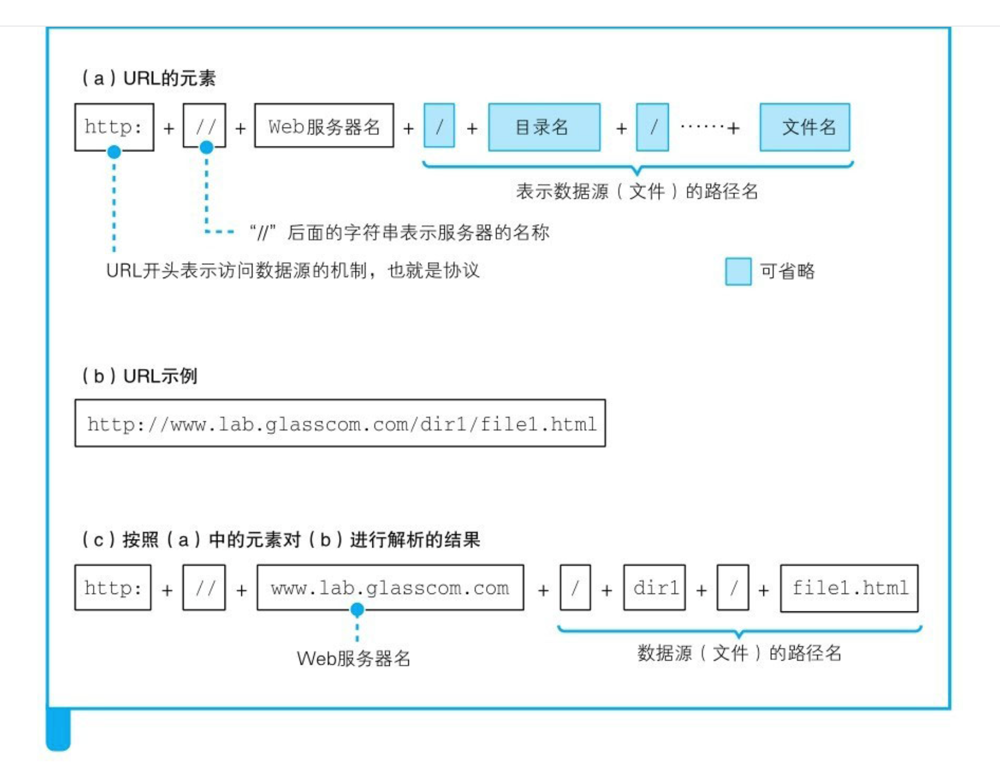
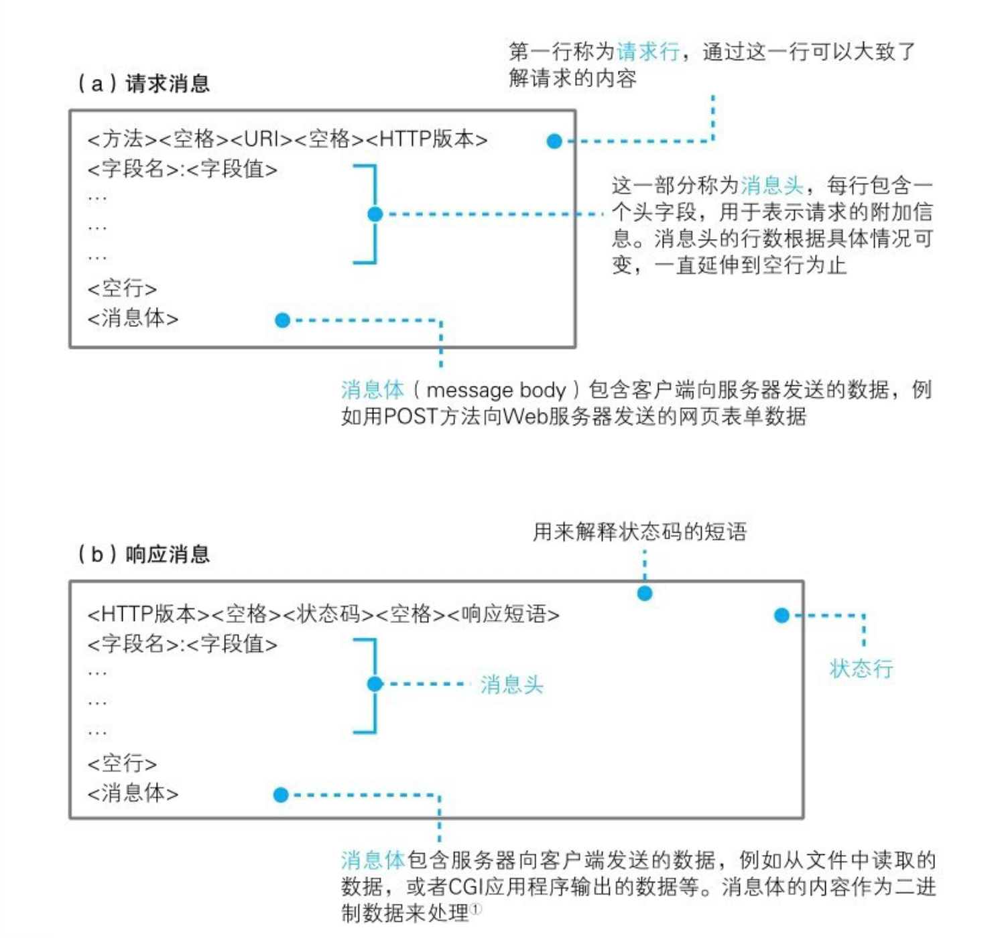
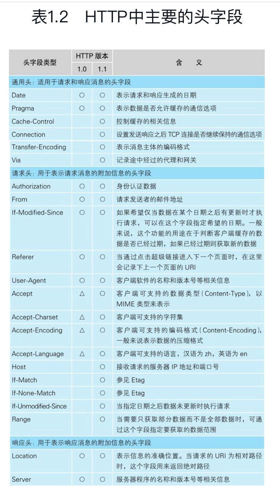
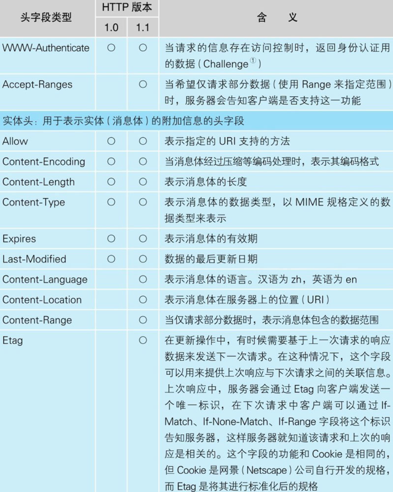

网络是怎样连接的

1
浏览器先要解析URL

以“/”结尾代表/dir/后面本来应该有的文件名被省略了。我们会在服务器上事先设置好文件名省略时要访问的默认文件名。这个设置根据服务器不同而不同，大多数情况下是index.html或者default.htm之类的文件名。

当没有路径名时，就代表访问根目录下事先设置的默认文件[插图]，也就是/index.html或者/default.htm这些文件，这样就不会发生混乱了。

http协议

生成http消息
消息格式

