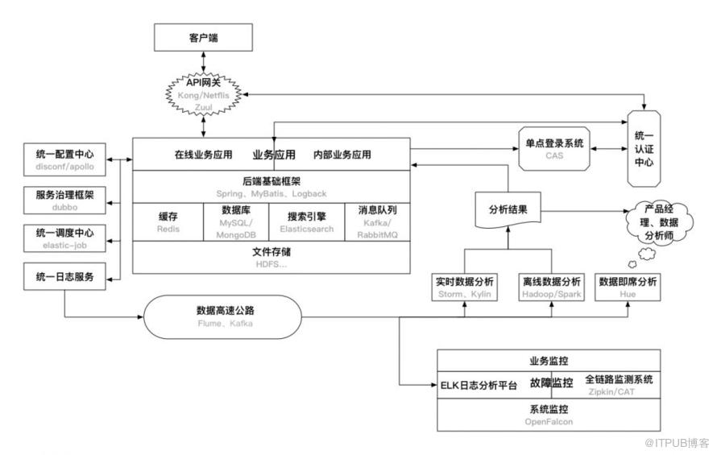

1 统一请求入口-API网关
负载均衡、API访问权限控制、用户鉴权集成到一起作为一个服务，既可以动态地修改权限控制和鉴权机制，也可以减少每个业务集成这些机制的成本。这种服务就是API网关，可以选择自己实现。也可以使用开源软件实现，如Kong和Netflix Zuul。
问题是由于所有API请求都要经过网关，它很容易成为系统的性能瓶颈。可以采取的方案是：去掉API网关，让业务应用直接对接统一认证中心，在基础框架层面保证每个API调用都需要先通过统一认证中心的认证，这里可以采取缓存认证结果的方式避免对统一认证中心产生过大的请求压力。

2 业务应用和后端基础框架
业务应用分为：在线业务应用和内部业务应用。
在线业务应用：直接面向互联网用户的应用、接口等，典型的特点就是：请求量大、高并发、对故障的容忍度低。
内部业务应用：主要面向公司内部用户的应用。比如，内部数据管理平台、广告投放平台等。相比起在线业务应用，其特点: 数据保密性高、压力小、并发量小、允许故障的发生。
MVC框架、IOC框架、ORM框架、缓存框架、JavaEE应用性能检测框架

3 缓存、数据库、搜索引擎、消息队列
这四者都是应用依赖的后端基础服务，他们的性能直接影响到了应用的整体性能

4 文件存储
不管是业务应用、依赖的后端服务还是其他的各种服务，最终还是要依赖于底层文件存储的。通常来说，文件存储需要满足的特性有：可靠性、容灾性、稳定性，即要保证存储的数据不会轻易丢失，即使发生故障也能够有回滚方案，也要保证高可用。在底层可以采用传统的RAID作为解决方案，再上一层，目前Hadoop的HDFS则是最为普遍的分布式文件存储方案，当然还有NFS、Samba这种共享文件系统也提供了简单的分布式存储的特性。

5 统一认证中心
统一认证中心，主要是对APP用户、内部用户、APP等的认证服务，包括
用户的注册、登录验证、Token鉴权
内部信息系统用户的管理和登录鉴权
APP的管理，包括APP的secret生成，APP信息的验证（如验证接口签名）等。
为了能够集中对这些所有APP都会用到的信息进行管理，也给所有应用提供统一的认证服务。尤其是在有很多业务需要共享用户数据的时候，构建一个统一认证中心是非常必要的。此外，通过统一认证中心构建移动APP的单点登录也是水到渠成的事情：模仿Web的机制，将认证后的信息加密存储到本地存储中供多个APP使用。

6 单点登录系统
单点登录的原理
比较成熟的、用的最多的单点登录系统应该是耶鲁大学开源的CAS, 可以基于 https://github.com/apereo/cas/tree/master/cas-server-webapp 来定制开发的。

7 统一配置中心
在Java后端应用中，一种读写配置比较通用的方式就是将配置文件写在Propeties、YAML、HCON等文件中，修改的时候只需要更新文件重新部署即可，可以做到不牵扯代码层面改动的目的。统一配置中心，则是基于这种方式之上的统一对所有业务或者基础后端服务的相关配置文件进行管理的统一服务, 具有以下特性：
能够在线动态修改配置文件并生效
配置文件可以区分环境（开发、测试、生产等）
在Java中可以通过注解、XML配置的方式引入相关配置
百度开源的Disconf和携程的Apollo是可以在生产环境使用的方案，也可以根据自己的需求开发自己的配置中心，一般选择Zookeeper作为配置存储。

8 服务治理框架
对于外部API调用或者客户端对后端API的访问，可以使用HTTP协议或者RESTful（当然也可以直接通过最原始的socket来调用）。但对于内部服务间的调用，一般都是通过RPC机制来调用的。
以配置中心为枢纽，调用关系只存在于Client和提供服务的Server之间，就避免了传统ESB的性能瓶颈问题。对于这种设计，ESB应该支持的特性如下：
服务提供方的注册、管理
服务消费者的注册、管理
服务的版本管理、负载均衡、流量控制、服务降级、资源隔离
服务的容错、熔断
阿里开源的Dubbo则对以上做了很好的实现

9 统一调度中心
在很多业务中，定时调度是一个非常普遍的场景，比如定时去抓取数据、定时刷新订单的状态等。通常的做法就是针对各自的业务依赖Linux的Cron机制或者Java中的Quartz。统一调度中心则是对所有的调度任务进行管理，这样能够统一对调度集群进行调优、扩展、任务管理等。

10 统一日志服务
通常的，将日志分散在各个业务中非常不方便对问题的管理和排查。统一日志服务则使用单独的日志服务器记录日志，各个业务通过统一的日志框架将日志输出到日志服务器上。
可以通过实现Log4j或者Logback的Appender来实现统一日志框架，然后通过RPC调用将日志打印到日志服务器上。

11 数据基础设施
数据高速公路，收集、传输
离线数据分析
实时数据分析
数据即席分析

12 故障监控
系统监控：主要指对主机的带宽、CPU、内存、硬盘、IO等硬件资源的监控。
业务监控：是在主机资源层面以上的监控，比如APP的PV、UV数据异常、交易失败等。

监控还有一个关键的步骤就是告警。告警的方式有很多种：邮件、IM、短信等。
故障告警应对

> https://blog.itpub.net/69940568/viewspace-2679148/