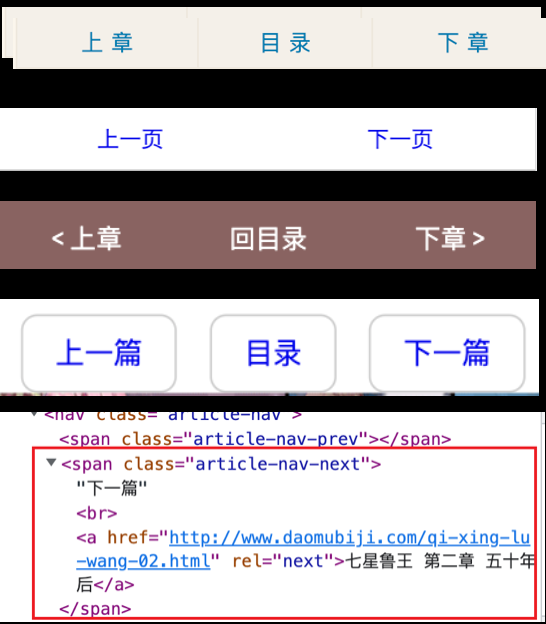
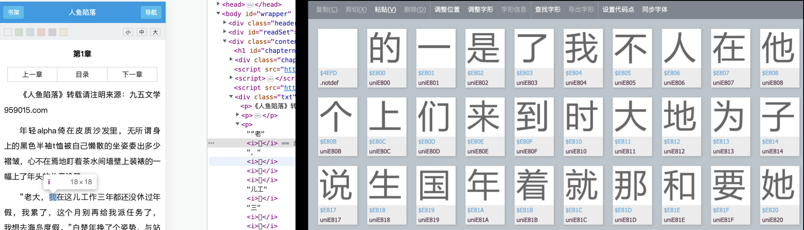
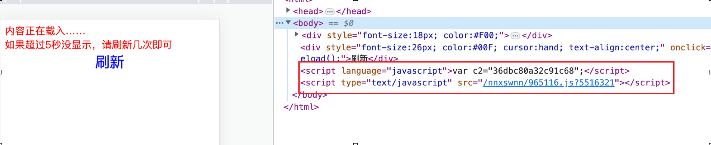
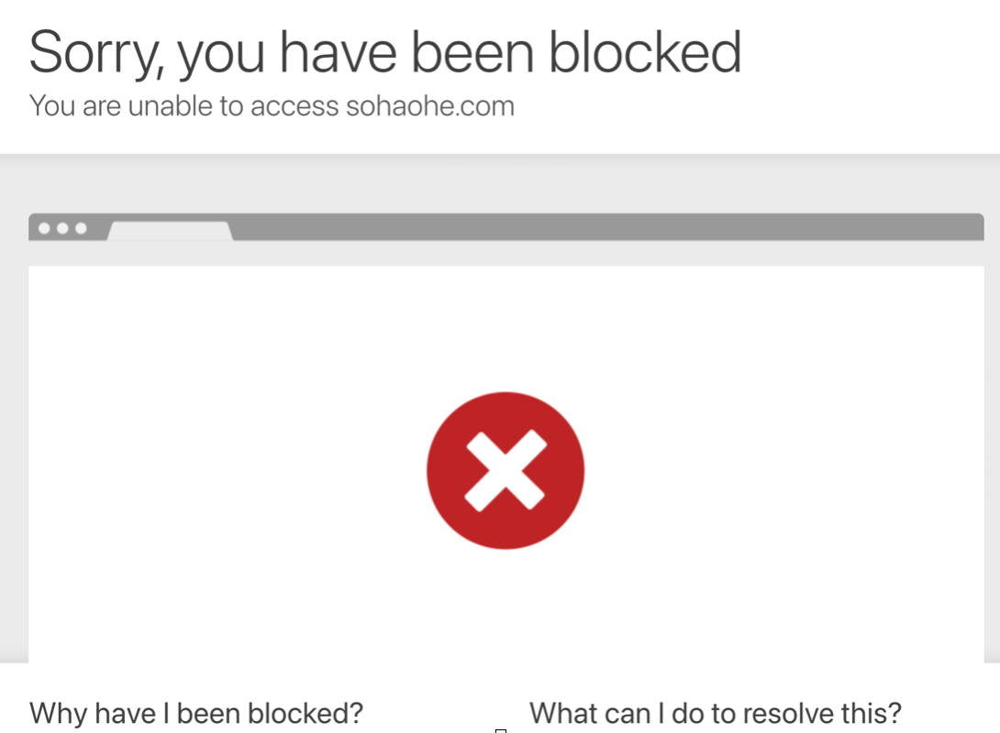
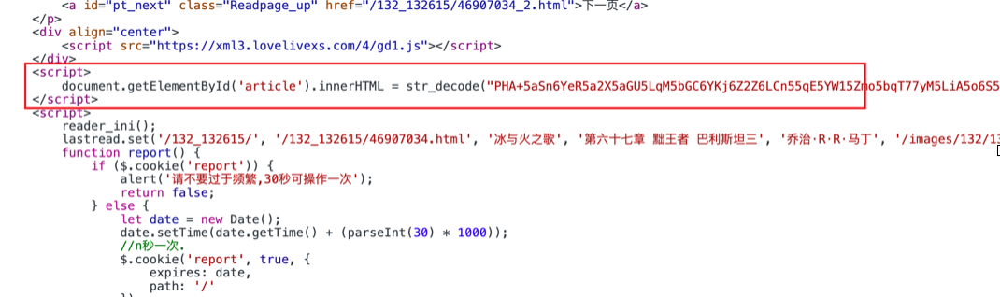
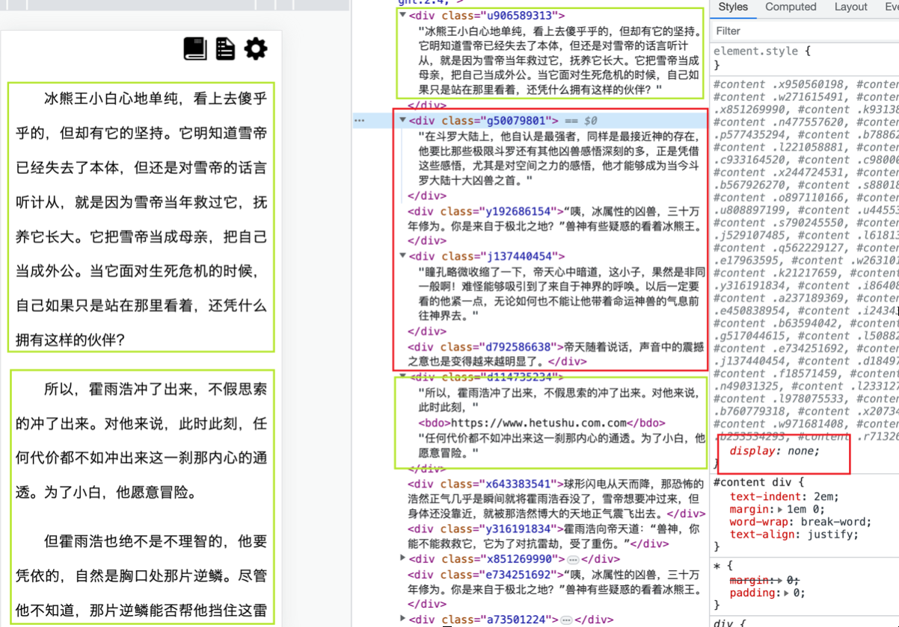
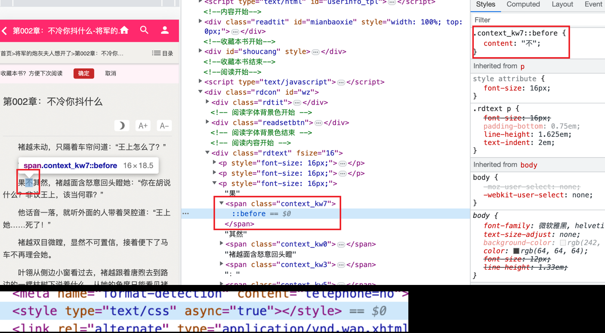

# 反爬方式

## 页面重定向
这个严格意义上来说不算是反爬，可能是小说网站url更换等原因
```js
const { http, https } = require('follow-redirects');
```

在nodejs中使用`follow-redirects`库来追踪重定向


## 奇形怪状的上下页按钮链接


1.各种非常规的文字替代 “上一页” “下一页” 按钮名
> ['上一章', '上一页', '上一篇', '上页', '上章', '↑↑↑', '<=', '<-', '上—章', '上—页', '上一頁', '上ー页'/* 中间是个短线 */, '上ー章', '上一\n章', '↑一页', '↑一章', 'prev', '上壹章', '上壹页', '上 页', '上 章', '上一节', '↑壹頁', '↑壹漳', '上一分节', ‘上一小节']

> ['下一章', '下一页', '下一篇', '下页', '下章', '↓↓↓', '=>', '->', '下—章', '下—页', '下①頁', '下一頁', '下ー页'/* 中间是个短线 */, '下ー章', '下一\n章', '↓一页', '↓一章', 'next', '下壹章', '下壹页', '下 页', '下 章', '下一节', '↓壹頁', '↓壹漳', '下一分节', '下一小节']

2.按钮元素不是纯粹的a标签
```js
document.evaluate(`.//a[li${query}] | .//a[button${query}] | .//a[font${query}] | .//span${query}/a | .//a[@id='pb_next'][img]`, document.body, null, 0, null)
```

## 按钮JavaScript跳转


没有显式的链接爬取，上下页的链接需要点击按钮，这种可以使用puppeteer做模拟点击处理

## 内容字符使用iconfont
所有的高频汉字都换成Unicode，端侧加载字体ttf或woff文件，利用iconfont的方式使内容爬取不完整。



## 站点需要cookie验证
首次访问页面进行cookie注入，随后重定向页面到正文



## 误入黑名单


可以通过增加代理访问，避免单一ip被封，但是会明显增加爬取耗时

## 内容编码，解码后才是真实内容


找到对应编解码规则，提取出真实文本

## 障眼法
段落配置唯一类名，一部分 display: block, 一部分 display: none，内容交错排列 



## 隐藏文字，真实内容用伪元素展示
文档加载后将style标签内的样式删除，文档内部样式依然生效



## 异步接口请求内容
文本内容不随html一起加载，通过后续接口获取后再填充到页面中